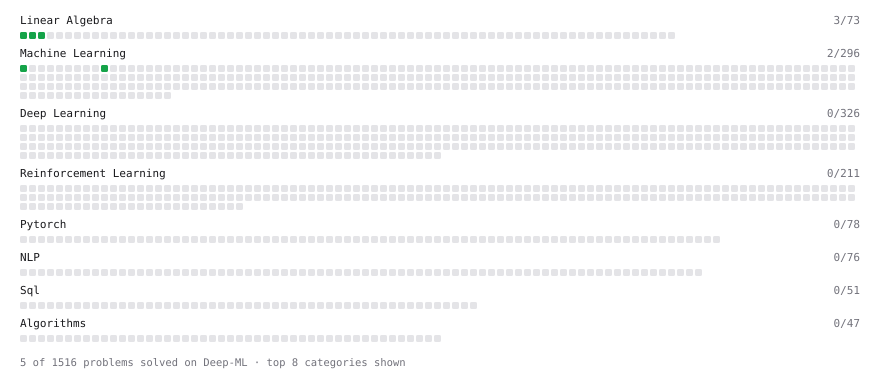

# Deep-ML

My machine learning practice from [Deep-ML](https://www.deep-ml.com). Every solution here was written by hand.

**15** solved · 5 problems · 0 labs · 10 math

[**Browse the interactive portfolio**](https://k-karthikn.github.io/deep-ml/) to replay this filling in over time.

## Problems

| | Difficulty | Solved | |
| --- | --- | --- | --- |
| [Batch Iterator for Dataset](https://www.deep-ml.com/problems/30) | easy | 2026-10-02 | [solution](problems/0030-batch-iterator-for-dataset) |
| [Linear Regression Using Normal Equation](https://www.deep-ml.com/problems/14) | easy | 2026-10-02 | [solution](problems/0014-linear-regression-using-normal-equation) |
| [Matrix-Vector Dot Product](https://www.deep-ml.com/problems/1) | easy | 2026-10-02 | [solution](problems/0001-matrix-vector-dot-product) |
| [Reshape Matrix](https://www.deep-ml.com/problems/3) | easy | 2026-10-02 | [solution](problems/0003-reshape-matrix) |
| [Transpose of a Matrix](https://www.deep-ml.com/problems/2) | easy | 2026-10-02 | [solution](problems/0002-transpose-of-a-matrix) |

## Math

| | Difficulty | Solved | |
| --- | --- | --- | --- |
| [Derivatives and Gradients](https://www.deep-ml.com/math-problems/1) | easy | 2026-10-03 | [solution](math/0001-derivatives-and-gradients) |
| [Matrix Basics](https://www.deep-ml.com/math-problems/9) | easy | 2026-10-02 | [solution](math/0009-matrix-basics) |
| [Vector Operations](https://www.deep-ml.com/math-problems/7) | easy | 2026-10-02 | [solution](math/0007-vector-operations) |
| [Covariance and Correlation](https://www.deep-ml.com/math-problems/17) | medium | 2026-10-03 | [solution](math/0017-covariance-and-correlation) |
| [Determinants and Trace](https://www.deep-ml.com/math-problems/11) | medium | 2026-10-03 | [solution](math/0011-determinants-and-trace) |
| [Inverse and Rank](https://www.deep-ml.com/math-problems/12) | medium | 2026-10-03 | [solution](math/0012-inverse-and-rank) |
| [Matrix Multiplication](https://www.deep-ml.com/math-problems/10) | medium | 2026-10-03 | [solution](math/0010-matrix-multiplication) |
| [Orthogonality and Projections](https://www.deep-ml.com/math-problems/14) | medium | 2026-10-03 | [solution](math/0014-orthogonality-and-projections) |
| [Solving Linear Systems](https://www.deep-ml.com/math-problems/13) | medium | 2026-10-03 | [solution](math/0013-solving-linear-systems) |
| [Vector Norms and Linear Independence](https://www.deep-ml.com/math-problems/8) | medium | 2026-10-02 | [solution](math/0008-vector-norms-and-linear-independence) |

---

_This file is regenerated by Deep-ML on every push._
